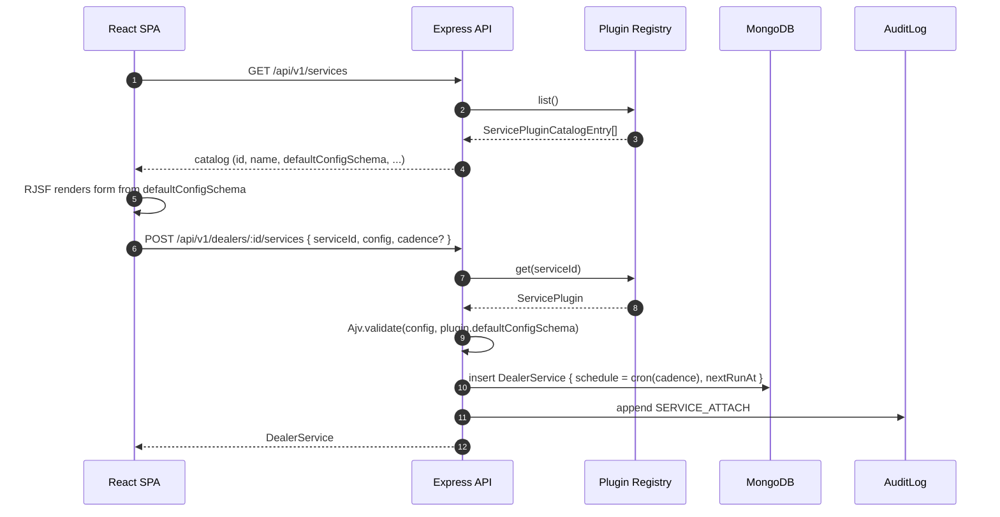
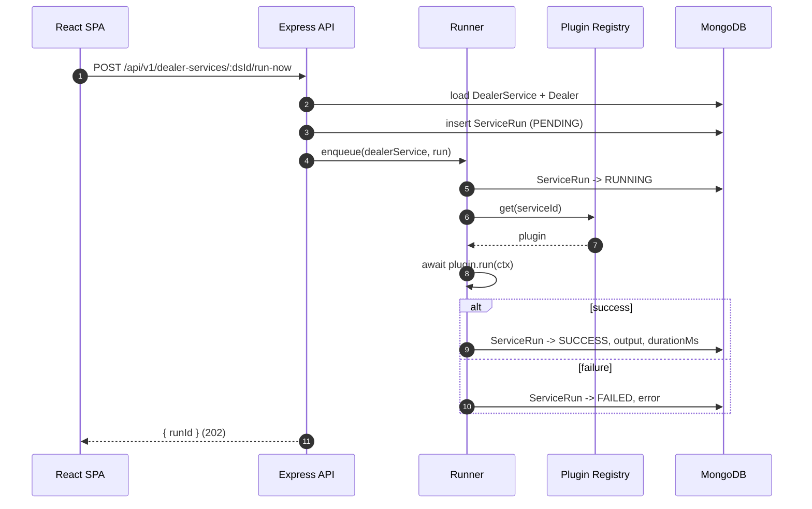
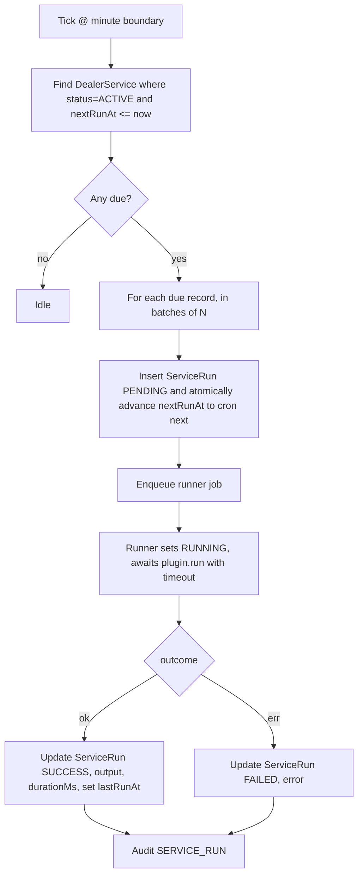

# Dealer Kavach - Architecture

This document captures the high-level architecture of the Dealer Kavach admin portal MVP. It is the source of truth for module boundaries, data flow, and the service-plugin contract. Detailed rationales live in `docs/ADR/`.

## 1. Goals

- Onboard petrol-pump dealers in a two-stage flow.
- Attach and run recurring service workflows per dealer (e.g. SLA report, compliance check, billing run).
- Make new workflows trivial to add - a folder drop, no central registry edit.
- Keep the operational surface small: one Node process, one Mongo, one React SPA.

## 2. Module layout

```
mdg-service/
├── shared/                  @dk/shared - types + Zod schemas (source of truth)
│   └── src/
│       ├── types/           Dealer, DealerService, ServiceRun, plugin contract, enums
│       └── schemas/         Zod schemas mirroring the types
├── backend/                 Node 20 + Express + Mongoose
│   └── src/
│       ├── app.ts           Express wiring (CORS, logging, error handler)
│       ├── server.ts        Boots HTTP server + scheduler
│       ├── config/          env, mongo connection, logger (Pino)
│       ├── auth/            JWT middleware, requireRoles(...)
│       ├── modules/
│       │   ├── dealers/     model, routes, service
│       │   ├── dealerServices/
│       │   ├── runs/
│       │   ├── audit/
│       │   └── overview/
│       ├── services/        PLUGINS LIVE HERE. One folder per plugin.
│       │   └── <slug>/index.ts + schema.ts
│       ├── plugin/          loader (glob), registry, runner, scheduler
│       └── shared/          error types, validate(zod) helper, pagination helper
├── frontend/                React 18 + Vite + Tailwind
│   └── src/
│       ├── app/             routes, providers, query client
│       ├── pages/           Login, Dealers, DealerDetail, Runs, Overview
│       ├── features/        feature-scoped components + hooks
│       ├── components/      shared UI primitives, RJSF wrapper
│       ├── lib/             api client, auth store, formatters
│       └── styles/          tailwind config, css tokens
├── docs/                    ADRs + style guide + API contract + onboarding guide
├── scripts/                 seed.ts, helpers
└── docker-compose.yml       mongo:7 (backend appended later)
```

## 3. Stack summary

| Layer       | Choice                                                                          |
|-------------|---------------------------------------------------------------------------------|
| Runtime     | Node 20 (`.nvmrc`)                                                              |
| API         | Express + Zod-validated request bodies + Pino structured logs                   |
| Data        | MongoDB 7 via Mongoose                                                          |
| Auth        | JWT (HS256), seeded admin, `requireRoles(...)` middleware seam                  |
| Scheduling  | `node-cron` in-process, tick every minute                                       |
| Plugin disc | `glob` over `backend/src/services/*/index.ts` at boot                           |
| Frontend    | React 18 + Vite + TS + Tailwind + TanStack Query + Zustand + React Router v6   |
| Forms       | React Hook Form + Zod for fixed forms, `@rjsf/core` + Ajv for plugin configs    |
| Icons       | Lucide                                                                          |
| Mono        | npm workspaces (`shared`, `backend`, `frontend`)                                |

## 4. Layering rules

- Routes call services. Services own the Mongoose models. Models never leak out of services.
- Plugins import nothing from `modules/`; they only see `ServiceRunContext` and the `@dk/shared` types.
- The frontend never imports backend code; it imports `@dk/shared` for types/schemas only.
- All write paths produce an `AuditLog` entry. Reads do not.

## 5. Request flow

### Attach service to dealer



### Run now (manual trigger)



## 6. Module layout + request flow diagram

```mermaid
flowchart LR
    subgraph FE[React SPA]
        UI[Pages + Components]
        RJSF[RJSF Form]
        UI -- TanStack Query --> ApiClient[lib/api]
    end

    subgraph BE[Express API]
        Router[/api/v1 routes/]
        Auth[JWT middleware]
        Services[modules/* services]
        Registry[Plugin Registry]
        Runner[Plugin Runner]
        Sched[Scheduler tick]
    end

    subgraph PLG[Plugins folder]
        P1[services/sla-report]
        P2[services/compliance-check]
        Pn[services/...]
    end

    Mongo[(MongoDB)]
    Shared[[@dk/shared types + zod]]

    FE <--HTTP /api/v1--> Router
    Router --> Auth --> Services
    Services --> Mongo
    Services --> Runner
    Sched --> Runner
    Runner --> Registry
    Registry -. glob discovery .-> PLG
    Runner --> Mongo

    Shared -.-> FE
    Shared -.-> BE
```

## 7. Scheduler

A single in-process `node-cron` job fires every minute. Each tick:



Key properties:

- **Pull, not push.** The tick queries Mongo for due work, so a restart never loses scheduled work.
- **Atomic claim.** `nextRunAt` is advanced in the same update that inserts the run, preventing duplicate fires across (eventually) multiple instances.
- **Bounded concurrency.** Runner uses a tiny in-memory queue (size N from env, default 4). Long-running plugins do not block the tick.
- **Timeouts.** Each `plugin.run` is wrapped in `Promise.race` with a configurable per-cadence timeout; on timeout the run is marked FAILED.
- **Out of scope for MVP:** distributed locking, retries, backoff. The seams (atomic claim, timeout) are there for later.

## 8. Plugin auto-discovery

At boot, `plugin/loader.ts` does:

1. `glob('backend/src/services/*/index.ts')`
2. Dynamic-imports each file.
3. Validates the default export against the `ServicePlugin` contract (id, name, description, cadence in `CADENCES`, `defaultConfigSchema` is a JSON object, `run` is a function).
4. Compiles `defaultConfigSchema` with Ajv and caches the validator alongside the plugin.
5. Indexes by `id` (folder name must match `plugin.id`).
6. Exposes `list()` and `get(id)`.

Adding a plugin is one folder. See `docs/ADDING_A_SERVICE.md`.

## 9. Data + indexes

Mongo collections and their indexes:

| Collection      | Indexes                                                                      |
|-----------------|------------------------------------------------------------------------------|
| admins          | `{ email: 1 }` unique                                                        |
| dealers         | `{ status: 1 }`, `{ name: 'text' }`, `{ gst: 1 }` unique, `{ pan: 1 }`        |
| dealerServices  | `{ dealerId: 1, serviceId: 1 }` unique, `{ status: 1 }`, `{ nextRunAt: 1 }`  |
| serviceRuns     | `{ dealerId: 1 }`, `{ serviceId: 1 }`, `{ status: 1 }`, `{ startedAt: -1 }`  |
| auditLogs       | `{ entity: 1, entityId: 1 }`, `{ at: -1 }`                                   |

## 10. Auth + RBAC seam

- JWT issued at `POST /auth/login`, lifetime 12h.
- Middleware `requireAuth` populates `req.admin`.
- `requireRoles(...roles)` checks `req.admin.roles`. For MVP every route uses `requireAuth` only; routes that should be role-gated later already call `requireRoles('admin')` as a no-op (admin role is on every seeded user). This is the seam called out in the role brief.

## 11. Out of scope for MVP

- Multi-tenant separation.
- Plugin sandboxing - plugins run in the same process. They are first-party code.
- Distributed scheduling / horizontal scale.
- File uploads (compliance docs are pre-uploaded URLs).
- WebSocket push for live run status (poll via TanStack Query).
