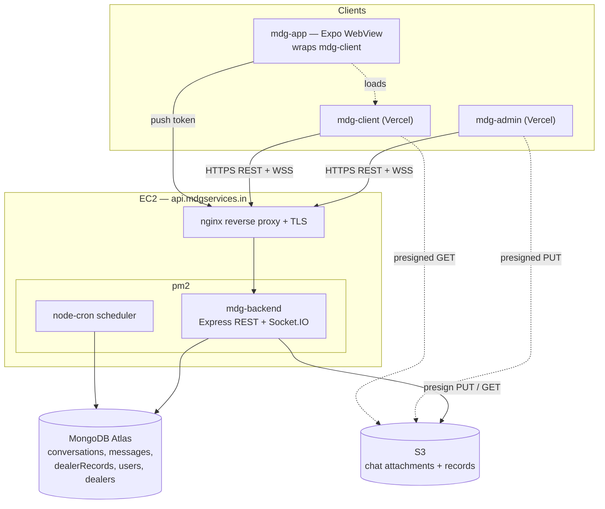
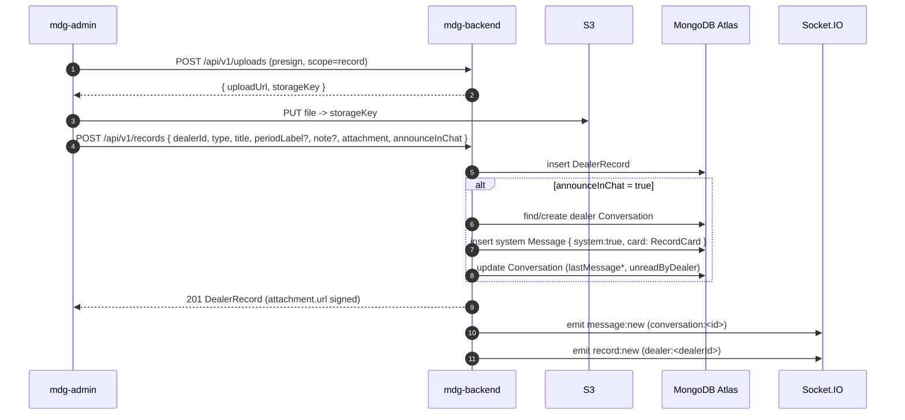

# MDG Service — Architecture V2

This document describes the **evolved** MDG architecture: a four-repo product (plus the vendored `@dk/shared`) with a chat-first dealer experience, a manual **Records** subsystem, and a lightweight, chat-native CRM/ticket layer built on top of conversations.

It supersedes the plugin-centric framing in [ARCHITECTURE.md](../ARCHITECTURE.md). The service-plugin runtime (auto-discovery, scheduler, runner) is unchanged and still authoritative there; this doc focuses on what is new: realtime chat, records, and tickets.

## 1. System shape

Four runtime repos, one shared package vendored into each:

| Repo          | Runtime                        | Hosting                                 | Responsibility                                                   |
| ------------- | ------------------------------ | --------------------------------------- | ---------------------------------------------------------------- |
| `mdg-backend` | Express + Socket.IO + Mongoose | EC2 (`api.mdgservices.in`, nginx + pm2) | REST `/api/v1`, realtime, scheduler, S3 presign                  |
| `mdg-admin`   | React + Vite                   | Vercel                                  | Dealer mgmt, 3-pane support inbox, records upload, ticket triage |
| `mdg-client`  | React + Vite (mobile-first)    | Vercel                                  | Dealer portal: chat-first, records shelf, services, profile      |
| `mdg-app`     | Expo (React Native)            | App stores                              | WebView shell around `mdg-client` + native push-token bridge     |
| `@dk/shared`  | TS types + Zod                 | vendored into each repo                 | Single source of truth for shapes/contracts                      |

`@dk/shared` is **vendored** (copied into each repo, not consumed via npm registry) so each repo builds and deploys independently. The canonical copy lives in this meta-repo's `shared/`.

### Deployment + component diagram

Notes:

- nginx terminates TLS and upgrades the Socket.IO connection (WSS) on the same origin as REST.
- Browsers upload/download files **directly** to/from S3 via short-lived presigned URLs; bytes never transit the backend.
- pm2 runs a single Node process; `node-cron` ticks in-process (see ARCHITECTURE.md §7).

## 2. Records subsystem

Dealers receive periodic artifacts — Daily Sales Reports, invoices, compliance docs, statements. V2 adds a first-class **`DealerRecord`** model so these are durable, listable, and discoverable independent of the chat scrollback.

### Model

`DealerRecord` (see `@dk/shared` `types/record.ts`, schema in `schemas/chat.ts`):

| Field                                   | Notes                                                             |
| --------------------------------------- | ----------------------------------------------------------------- |
| `dealerId`                              | owning dealer                                                     |
| `type`                                  | `dsr \| invoice \| compliance \| statement \| other`              |
| `title`                                 | card title, e.g. "Daily Sales Report"                             |
| `periodLabel?`                          | period covered, e.g. "March 2026"                                 |
| `note?`                                 | free-text from the uploader                                       |
| `attachment`                            | `Attachment` (S3 `storageKey`, filename, contentType, size, kind) |
| `uploadedByAdminId` / `uploadedByName?` | provenance                                                        |
| `createdAt` / `updatedAt`               | timestamps                                                        |

Suggested indexes: `{ dealerId: 1, createdAt: -1 }`, `{ dealerId: 1, type: 1 }`.

`RecordCard` is a lightweight reference embedded on a `Message` (`message.card`) so a record can render inline in chat without re-fetching the full record.

### Upload flow (manual, admin-driven)

For the MVP, records are **uploaded manually by an admin**. Automated generation is deferred (see ADR 0004).

Key points:

- The system `Message` carries `system: true` and a `card` of `{ kind:'record', recordId, recordType, title, periodLabel }`. No body text is required.
- `announceInChat` defaults to `true` (per `createRecordSchema`); when `false`, the record lands only in the Records shelf.
- Record list/detail responses **populate `attachment.url`** with a freshly signed GET URL; the persisted document stores only `storageKey`.

## 3. Ticket / CRM layer

A `Conversation` is **the ticket**. There is exactly one conversation per dealer (the model enforces `dealerId` unique), and ticket metadata lives directly on it:

- **`status`**: `OPEN` → `ASSIGNED` → `RESOLVED` (lifecycle for triage).
- **`assignedAdminId`**: who owns it; surfaced to admins in the inbox.
- **`priority`** (`low \| normal \| high \| urgent`) — **admin-only**, never serialized to dealers.
- **`category`** (`general \| sales \| compliance \| billing \| technical \| onboarding`) — **admin-only**.
- **Audit**: status/assignment/priority/category changes append to the existing audit log (same pattern as dealer audit).

### Why chat-native CRM (not a traditional one)

- **One surface, not two.** Support context _is_ the conversation. No separate ticket object to keep in sync with the chat thread — the thread is the ticket history.
- **Zero dealer-facing complexity.** Dealers see a chat. Priority/category/assignment are stripped from dealer responses, so the CRM is invisible to them.
- **Cheap to operate.** No pipeline/stage engine, no SLA automation, no third-party CRM integration. Triage fields are a few optional columns on a document the team already reads.
- **Natural growth path.** If real CRM needs emerge, the seams (status enum, category, priority, assignment, audit) are already modeled and can be lifted into a dedicated service later.

## 4. Records UX contract

- **Chat is the default landing** in `mdg-client`. A dealer opening the portal sees their conversation.
- **In-chat cards**: when a record is announced, it appears inline as a tappable record card (rendered from `message.card`), so delivery is conversational.
- **Records shelf**: a dedicated, filterable list (by `type`) of all the dealer's records, backed by `GET /api/v1/records`. This is the durable home for artifacts so they don't get lost in scrollback.
- Tapping a card or a shelf row opens/downloads the file via the signed `attachment.url`.
- Admins get the mirror: upload form (presign + create) and a per-dealer record list (`?dealerId=`).

## 5. API surface (new in V2)

All under `/api/v1`. Bodies/shapes reference `@dk/shared`.

| Method  | Path                        | Body                                       | Response             | Notes                                                                               |
| ------- | --------------------------- | ------------------------------------------ | -------------------- | ----------------------------------------------------------------------------------- |
| `POST`  | `/records`                  | `CreateRecordInput` (`createRecordSchema`) | `DealerRecord` (201) | admin-only; presign+PUT first; may post a system message                            |
| `GET`   | `/records`                  | —                                          | `DealerRecord[]`     | dealer: own records only; admin: filter `?dealerId=&type=`; `attachment.url` signed |
| `GET`   | `/records/:id`              | —                                          | `DealerRecord`       | dealer scoped to own `dealerId`; `attachment.url` signed                            |
| `PATCH` | `/conversations/:id/ticket` | `UpdateTicketInput` (`updateTicketSchema`) | `Conversation`       | admin-only; sets `priority`/`category`; audited                                     |

Supporting (existing) endpoints used by these flows: `POST /uploads` (presign), `POST /conversations/:id/messages` (chat), conversation assign/status routes.

`GET /records` responses always populate `attachment.url` with a signed URL; never return raw storage keys to clients expecting a download.

## 6. Realtime

Socket.IO over the same origin (WSS via nginx). JWT is passed in the handshake (`auth.token` or `Authorization`) and verified before any room join.

Rooms:

| Room                | Members                          | Purpose                                                   |
| ------------------- | -------------------------------- | --------------------------------------------------------- |
| `inbox:admins`      | all admins                       | inbox-wide `conversation:updated` fan-out                 |
| `conversation:<id>` | participants who joined a thread | `message:new`, `typing`, `read`                           |
| `dealer:<dealerId>` | a dealer's users                 | dealer-scoped `conversation:updated` and **`record:new`** |

Events (`ServerToClientEvents`):

- `message:new` — new message (incl. system record-card messages) to `conversation:<id>`; `conversation:updated` to `inbox:admins` and `dealer:<dealerId>`.
- `conversation:updated` — ticket/assignment/unread changes.
- **`record:new`** (new in V2) — `{ record: DealerRecord }` emitted to `dealer:<dealerId>` so the Records shelf updates live even when the dealer isn't viewing chat.
- `typing`, `read` — presence/receipts within a conversation room.

Room membership: admins auto-join `inbox:admins`; dealers auto-join `dealer:<dealerId>` on connect; `conversation:<id>` is joined on demand, gated by `isParticipant` (admins → any conversation; dealers → only their own `dealerId`).

## 7. Security / roles

- **Auth**: JWT (HS256, 12h) for both REST and the Socket.IO handshake.
- **Route-level RBAC only.** Roles are `admin`, `dealer-owner`, `dealer-staff`. There is no field/row policy engine — authorization is enforced at the route/middleware boundary and by explicit scoping queries.
- **Dealer scoping**: every dealer-facing read/write is constrained to `req.user.dealerId`. A dealer can never name another dealer's `dealerId`; for records and conversations the query is forced to their own id server-side.
- **Admin-only writes**: `POST /records`, `PATCH /conversations/:id/ticket`, assignment/status changes. Triage fields (`priority`, `category`) are stripped from any dealer-facing serialization.
- **Files**: presigned URLs are short-lived and per-object; the backend mediates which `storageKey` a caller may presign/read based on ownership.

## 8. Out of scope (V2)

- Automated record generation (DSR/invoice pipelines) — deferred; see ADR 0004.
- Multi-conversation per dealer / threaded tickets.
- Field-level RBAC, SLA timers, CRM pipeline stages.
- Push notification delivery beyond token capture in `mdg-app`.

---

See also: [ADR 0004 — Records and chat-native CRM](./ADR/0004-records-and-chat-native-crm.md).
