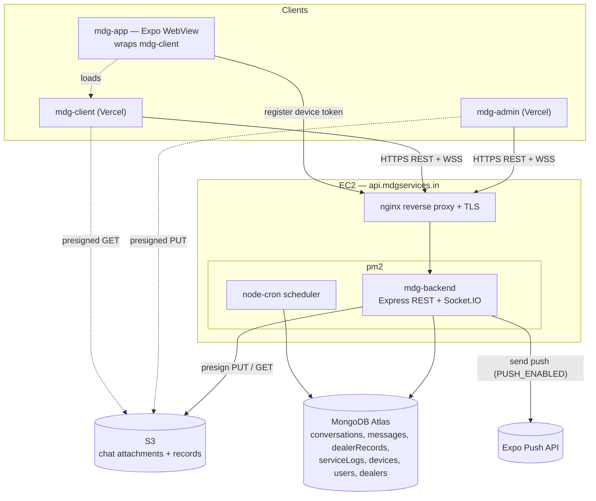
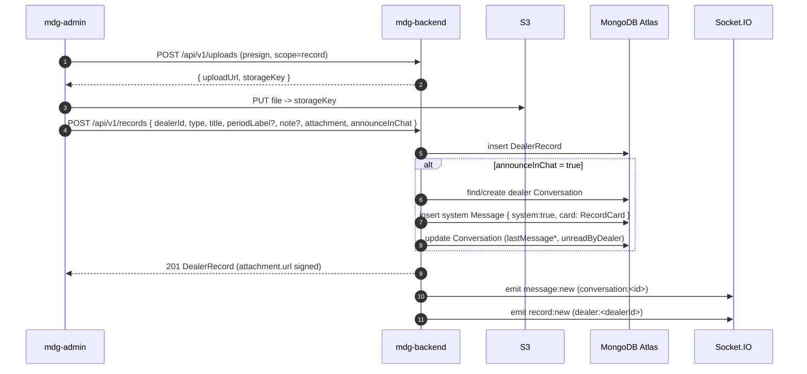

# MDG Service — Architecture V2

This document describes the **evolved** MDG architecture: a four-repo product (plus the vendored `@dk/shared`) with a chat-first dealer experience, a manual **Records** subsystem, and a lightweight, chat-native CRM/ticket layer built on top of conversations.

It supersedes the plugin-centric framing in [ARCHITECTURE.md](../ARCHITECTURE.md). The service-plugin runtime (auto-discovery, scheduler, runner) is unchanged and still authoritative there; this doc focuses on what is new: realtime chat, records, and tickets.

Dealer communication is **fully app-native**: each member talks to support inside `mdg-client` (wrapped by `mdg-app`). There is no WhatsApp channel — onboarding issues an app login (email + password) instead of creating chat groups (see ADR 0005). Conversations are **per member** (private threads), while records and service history are **shared at the organisation/dealer level**.

## 1. System shape

Four runtime repos, one shared package vendored into each:

| Repo          | Runtime                        | Hosting                                 | Responsibility                                                                                     |
| ------------- | ------------------------------ | --------------------------------------- | -------------------------------------------------------------------------------------------------- |
| `mdg-backend` | Express + Socket.IO + Mongoose | EC2 (`api.mdgservices.in`, nginx + pm2) | REST `/api/v1`, realtime, scheduler, S3 presign                                                    |
| `mdg-admin`   | React + Vite                   | Vercel                                  | Dealer mgmt, 3-pane support inbox, records upload, ticket triage                                   |
| `mdg-client`  | React + Vite (mobile-first)    | Vercel                                  | Dealer portal: chat-first, records shelf, services, profile                                        |
| `mdg-app`     | Expo (React Native)            | App stores                              | WebView shell around `mdg-client` + native push bridge (token register/unregister, deep-link taps) |
| `@dk/shared`  | TS types + Zod                 | vendored into each repo                 | Single source of truth for shapes/contracts                                                        |

`@dk/shared` is **vendored** (copied into each repo, not consumed via npm registry) so each repo builds and deploys independently. The canonical copy lives in this meta-repo's `shared/`.

### Deployment + component diagram

Notes:

- nginx terminates TLS and upgrades the Socket.IO connection (WSS) on the same origin as REST.
- Browsers upload/download files **directly** to/from S3 via short-lived presigned URLs; bytes never transit the backend.
- pm2 runs a single Node process; `node-cron` ticks in-process (see ARCHITECTURE.md §7).
- `mdg-app` registers/unregisters its Expo push token via `POST/DELETE /api/v1/devices`; the backend sends notifications through the Expo Push API when `PUSH_ENABLED` is on (see §6.1).
- Dealer communication is **app-native** — there is no WhatsApp channel; every dealer member talks to support inside `mdg-client` (wrapped by `mdg-app`).

## 2. Records subsystem

Dealers receive periodic artifacts — Daily Sales Reports, invoices, compliance docs, statements. V2 adds a first-class **`DealerRecord`** model so these are durable, listable, and discoverable independent of the chat scrollback.

### Model

`DealerRecord` (see `@dk/shared` `types/record.ts`, schema in `schemas/chat.ts`):

| Field                                   | Notes                                                             |
| --------------------------------------- | ----------------------------------------------------------------- |
| `dealerId`                              | owning dealer                                                     |
| `type`                                  | `dsr \| invoice \| compliance \| statement \| other`              |
| `title`                                 | card title, e.g. "Daily Sales Report"                             |
| `periodLabel?`                          | period covered, e.g. "March 2026"                                 |
| `note?`                                 | free-text from the uploader                                       |
| `attachment`                            | `Attachment` (S3 `storageKey`, filename, contentType, size, kind) |
| `uploadedByAdminId` / `uploadedByName?` | provenance                                                        |
| `createdAt` / `updatedAt`               | timestamps                                                        |

Suggested indexes: `{ dealerId: 1, createdAt: -1 }`, `{ dealerId: 1, type: 1 }`.

Records are **owned by the dealer organisation**, not by an individual member — every member of a dealer (owner and managers) sees the same Records shelf. A new record fans out to all members of the org (see §6).

`RecordCard` is a lightweight reference embedded on a `Message` (`message.card`) so a record can render inline in chat without re-fetching the full record.

### `ServiceLog` model (manual service history)

Services are delivered **by hand**. Each delivered service is recorded as a `ServiceLog`, building a per-dealer "services provided" history that is surfaced on the admin dealer detail page. A service log is also **required when an admin resolves a conversation** (see §3 and §5).

| Field                               | Notes                                                                                     |
| ----------------------------------- | ----------------------------------------------------------------------------------------- |
| `dealerId`                          | owning dealer (org-level; shared across members)                                          |
| `serviceId`                         | id from the existing service catalog (`GET /services`), or the literal `'other'`          |
| `serviceName`                       | display name; required free-text when `serviceId === 'other'`, otherwise the catalog name |
| `notes`                             | **required** free-text describing what was done                                           |
| `conversationId?`                   | set when the log was created by resolving a conversation                                  |
| `loggedByAdminId` / `loggedByName?` | provenance                                                                                |
| `createdAt` / `updatedAt`           | timestamps                                                                                |

Suggested indexes: `{ dealerId: 1, createdAt: -1 }`. Like records, service history is **shared at the organisation (dealer) level**, not per member.

### `Device` model (push notification targets)

Each member's installed `mdg-app` registers its Expo push token as a `Device`. Tokens are how the backend reaches a specific member's phone.

| Field                     | Notes                                                        |
| ------------------------- | ------------------------------------------------------------ |
| `userId`                  | the member who owns this device                              |
| `dealerId`                | denormalised for org-wide fan-out (e.g. `record:new` pushes) |
| `expoPushToken`           | unique Expo token (`ExponentPushToken[...]`)                 |
| `platform?`               | `ios \| android`                                             |
| `createdAt` / `updatedAt` | timestamps                                                   |

Suggested indexes: `{ expoPushToken: 1 }` unique, `{ userId: 1 }`, `{ dealerId: 1 }`. Devices are registered/unregistered via `POST/DELETE /api/v1/devices` (see §5) and consumed by the Expo push sender (see §6.1).

### Upload flow (manual, admin-driven)

For the MVP, records are **uploaded manually by an admin**. Automated generation is deferred (see ADR 0004).

Key points:

- The system `Message` carries `system: true` and a `card` of `{ kind:'record', recordId, recordType, title, periodLabel }`. No body text is required.
- `announceInChat` defaults to `true` (per `createRecordSchema`); when `false`, the record lands only in the Records shelf.
- Record list/detail responses **populate `attachment.url`** with a freshly signed GET URL; the persisted document stores only `storageKey`.

## 3. Ticket / CRM layer

A `Conversation` is **the ticket**, and a ticket now belongs to an individual **member**, not the whole organisation. A dealer (= organisation / petrol pump) can have multiple members — the owner and one or more managers (managers reuse the `dealer-staff` role with `title: "Manager"`). **Each member gets their own private conversation with support.**

- The `Conversation` model gained a **`userId`** field and enforces `userId` **unique** (one thread per member). It is **no longer** one-per-dealer; `dealerId` is retained for grouping but is not unique on conversations.
- The admin inbox lists conversations **per member**, **grouped by organisation** (dealer), so support can see every thread under a pump.
- **Records and service history remain shared at the organisation (dealer) level** — they are not partitioned per member. Only the chat thread is private to a member.

Ticket metadata lives directly on the conversation:

- **`status`**: `OPEN` → `ASSIGNED` → `RESOLVED` (lifecycle for triage).
- **`assignedAdminId`**: who owns it; surfaced to admins in the inbox.
- **`priority`** (`low \| normal \| high \| urgent`) — **admin-only**, never serialized to dealers.
- **`category`** (`general \| sales \| compliance \| billing \| technical \| onboarding`) — **admin-only**.
- **Audit**: status/assignment/priority/category changes append to the existing audit log (same pattern as dealer audit).

### Resolving requires a service log

`POST /api/v1/conversations/:id/resolve` **requires a service log** in its body: a `serviceId` chosen from the service catalog (`GET /services`) — or the literal `'other'` plus a free-text `serviceName` — together with required `notes`. Resolving creates a `ServiceLog` (linked to the conversation and dealer) and only then flips the conversation to `RESOLVED`. This guarantees the per-dealer "services provided" history stays accurate because the moment work is closed out, it is logged.

### Why chat-native CRM (not a traditional one)

- **One surface, not two.** Support context _is_ the conversation. No separate ticket object to keep in sync with the chat thread — the thread is the ticket history.
- **Zero dealer-facing complexity.** Dealers see a chat. Priority/category/assignment are stripped from dealer responses, so the CRM is invisible to them.
- **Cheap to operate.** No pipeline/stage engine, no SLA automation, no third-party CRM integration. Triage fields are a few optional columns on a document the team already reads.
- **Natural growth path.** If real CRM needs emerge, the seams (status enum, category, priority, assignment, audit) are already modeled and can be lifted into a dedicated service later.

## 4. Records UX contract

- **Chat is the default landing** in `mdg-client`. A dealer opening the portal sees their conversation.
- **In-chat cards**: when a record is announced, it appears inline as a tappable record card (rendered from `message.card`), so delivery is conversational.
- **Records shelf**: a dedicated, filterable list (by `type`) of all the dealer's records, backed by `GET /api/v1/records`. This is the durable home for artifacts so they don't get lost in scrollback.
- Tapping a card or a shelf row opens/downloads the file via the signed `attachment.url`.
- Records are **org-shared**: every member of the dealer sees the same shelf, and a new record pushes to all of them.
- Admins get the mirror: upload form (presign + create), a per-dealer record list (`?dealerId=`), and a per-dealer **services-provided** history (`GET /service-logs?dealerId=`) on the dealer detail page.

## 5. API surface (new in V2)

All under `/api/v1`. Bodies/shapes reference `@dk/shared`.

| Method   | Path                         | Body                                       | Response             | Notes                                                                                                                                        |
| -------- | ---------------------------- | ------------------------------------------ | -------------------- | -------------------------------------------------------------------------------------------------------------------------------------------- |
| `POST`   | `/records`                   | `CreateRecordInput` (`createRecordSchema`) | `DealerRecord` (201) | admin-only; presign+PUT first; may post a system message; fans out to all org members                                                        |
| `GET`    | `/records`                   | —                                          | `DealerRecord[]`     | dealer: own org records; admin: filter `?dealerId=&type=`; `attachment.url` signed                                                           |
| `GET`    | `/records/:id`               | —                                          | `DealerRecord`       | dealer scoped to own `dealerId`; `attachment.url` signed                                                                                     |
| `PATCH`  | `/conversations/:id/ticket`  | `UpdateTicketInput` (`updateTicketSchema`) | `Conversation`       | admin-only; sets `priority`/`category`; audited                                                                                              |
| `POST`   | `/conversations/:id/resolve` | `ResolveConversationInput` (service log)   | `Conversation`       | admin-only; **requires a service log** (`serviceId` or `'other'`+`serviceName`, `notes`); creates a `ServiceLog` then sets status `RESOLVED` |
| `GET`    | `/service-logs`              | —                                          | `ServiceLog[]`       | admin; filter `?dealerId=`; per-dealer "services provided" history (org-shared)                                                              |
| `POST`   | `/service-logs`              | `CreateServiceLogInput`                    | `ServiceLog` (201)   | admin-only; manual service entry independent of a conversation                                                                               |
| `POST`   | `/devices`                   | `RegisterDeviceInput` (`expoPushToken`, …) | `Device`             | registers the caller's Expo push token; upsert by token                                                                                      |
| `DELETE` | `/devices`                   | `{ expoPushToken }`                        | `204`                | unregisters a token (logout / push opt-out)                                                                                                  |

Supporting (existing) endpoints used by these flows: `POST /uploads` (presign), `POST /conversations/:id/messages` (chat), `GET /services` (service catalog for the resolve service log), conversation assign/status routes.

`GET /records` responses always populate `attachment.url` with a signed URL; never return raw storage keys to clients expecting a download.

## 6. Realtime

Socket.IO over the same origin (WSS via nginx). JWT is passed in the handshake (`auth.token` or `Authorization`) and verified before any room join.

Rooms:

| Room                | Members                          | Purpose                                                                 |
| ------------------- | -------------------------------- | ----------------------------------------------------------------------- |
| `inbox:admins`      | all admins                       | inbox-wide `conversation:updated` fan-out                               |
| `conversation:<id>` | participants who joined a thread | `message:new`, `typing`, `read`                                         |
| `user:<userId>`     | a single member                  | that member's `conversation:updated` (their private thread)             |
| `dealer:<dealerId>` | all of a dealer's members        | org-wide fan-out — **`record:new`** (records are shared across the org) |

Because conversations are now per member, **conversation-scoped events target the member's `user:<userId>` room, not the whole dealer room**. The dealer room is reserved for genuinely org-wide events (records).

Events (`ServerToClientEvents`):

- `message:new` — new message (incl. system record-card messages) to `conversation:<id>`; `conversation:updated` to `inbox:admins` and to the owning member's `user:<userId>`.
- `conversation:updated` — ticket/assignment/unread changes, delivered to the member's `user:<userId>` room.
- **`record:new`** — `{ record: DealerRecord }` emitted to `dealer:<dealerId>` so every org member's Records shelf updates live even when they aren't viewing chat.
- `typing`, `read` — presence/receipts within a conversation room.

Room membership: admins auto-join `inbox:admins`; each member auto-joins both `user:<userId>` (their thread updates) and `dealer:<dealerId>` (org records) on connect; `conversation:<id>` is joined on demand, gated by `isParticipant` (admins → any conversation; a member → only their own conversation).

### 6.1 Push notification delivery

Push is **implemented**, not just token capture. An Expo push sender (`lib/push/expoPush.ts`, gated by the `PUSH_ENABLED` env flag) looks up the target member's registered `Device` tokens and sends through the Expo Push API. Triggers:

| Event            | Recipient(s)                  | Source                             |
| ---------------- | ----------------------------- | ---------------------------------- |
| Admin reply      | the member whose thread it is | `POST /conversations/:id/messages` |
| New record       | **all** members of the org    | `POST /records`                    |
| Request resolved | the member whose thread it is | `POST /conversations/:id/resolve`  |

`mdg-client` registers its Expo token (and unregisters on logout / opt-out) and handles deep-link taps via the existing native bridge in `mdg-app`, opening the relevant chat or record. With `PUSH_ENABLED=false`, the triggers no-op cleanly so non-app environments are unaffected.

## 7. Security / roles

- **Auth**: JWT (HS256, 12h) for both REST and the Socket.IO handshake.
- **Route-level RBAC only.** Roles are `admin`, `dealer-owner`, `dealer-staff`. There is no field/row policy engine — authorization is enforced at the route/middleware boundary and by explicit scoping queries.
- **Dealer scoping**: every dealer-facing read/write is constrained to `req.user.dealerId`. A member can never name another dealer's `dealerId`; for records and service history the query is forced to their own org id server-side. For conversations, a member is additionally scoped to **their own** thread (`userId`), so members of the same org cannot read each other's private chats.
- **Admin-only writes**: `POST /records`, `PATCH /conversations/:id/ticket`, assignment/status changes. Triage fields (`priority`, `category`) are stripped from any dealer-facing serialization.
- **Files**: presigned URLs are short-lived and per-object; the backend mediates which `storageKey` a caller may presign/read based on ownership.

## 8. Out of scope (V2)

- Automated record generation (DSR/invoice pipelines) — deferred; see ADR 0004.
- Multiple **simultaneous** conversations per member / threaded tickets within a single member's chat. (One private thread per member is in scope; one ticket at a time per thread.)
- Field-level RBAC, SLA timers, CRM pipeline stages.

Now **in scope** (implemented since the original V2 cut, see ADR 0005):

- **Push notification delivery** via the Expo Push API (`PUSH_ENABLED`), triggered on admin replies, new records, and resolutions — no longer just token capture.
- **Manual service logging** (`ServiceLog`), including the mandatory service log on conversation resolution, building a per-dealer "services provided" history.
- **Per-member private conversations** with org-shared records and service history.
- **App-first onboarding** (app login issuance) replacing the former WhatsApp-group flow.

---

See also: [ADR 0004 — Records and chat-native CRM](./ADR/0004-records-and-chat-native-crm.md), [ADR 0005 — App-first onboarding, per-member chat, push, and service logs](./ADR/0005-app-first-onboarding-per-member-chat-push-and-service-logs.md).
